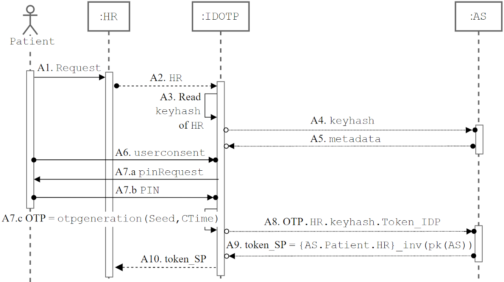

Despite the generality of our protocol, for concreteness, we describe our solution in the context of mHealth applications. We instantiate the entities described in Section 3 with the entities involved in a mHealth scenario:
- *Patient* plays the role of User who wants to access her Personal Health Record (PHR) on her smartphone.
- *AS* (stands for "Authentication Service") is the IdP of the local health care system and plays the role of IdPs.
- *ASOTP* plays the role of IDOTP and manages the generation of OTPs and the SSO experience for the apps installed on the phone that are part of the federation.
- *HR* (stands for "Health Record") plays the role of SPc and is one of the apps that are part of the AS federation and it is used by the Patient to read her PHR.

Figure 1, shows the exploitable phase of our protocol for this use-case.

<figure>
  
  <figcaption>Figure 1. MSC of the exploitation phase - ASOTP use-case</figcaption>
</figure> 

The protocol is formalized using ASLan++, a high-level language that formalizes the interactions between the different protocol roles, where a role represents a sequence of operations (e.g., sending and receiving messages) that must be executed by the agent that plays that role.

**ASLan++ file**: [idotp.aslan++](https://drive.google.com/file/d/1dHc76yLcXOYU7mRc0jUk7hElv7EGvOZm/view?usp=sharing)