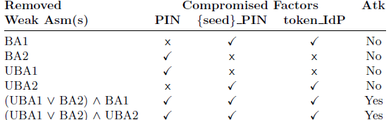
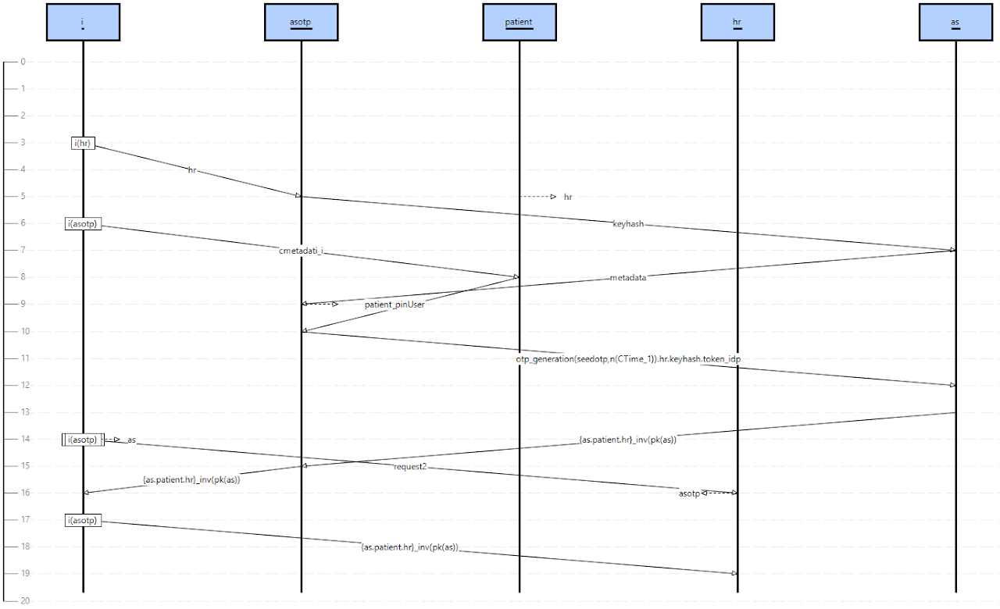
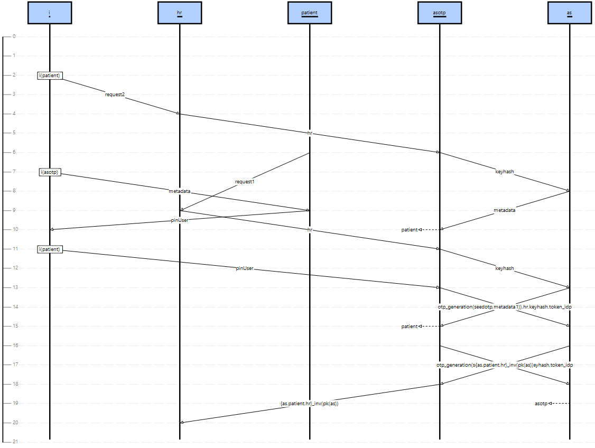
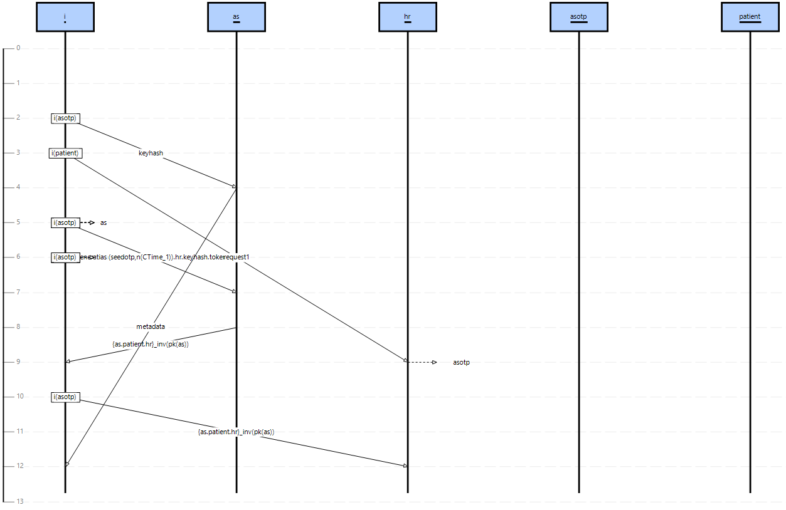

We report below the security analyses performed for:

**(G1)** `SP_authn_U_on_Request:(_) Patient*->>HR;`

Regarding the strong assumptions (TA, ComA1, ComA2, ComA3 and ActivA), we have performed the following analysis:
- **Analysis 1**: We have checked that by removing only one of the five strong assumptions from the model we have a violation of G1 (i.e. there is an attack). For this analysis, we have performed 5 executions of SATMC removing one strong assumption at a time. To provide an example of an attack, Figure 1 shows the attack trace deriving from removing ComA2. In this attack, i can impersonate hr, simply because the channel used to exchange its identity is not authentic, thus i can pretend to be another app.

Regarding the weak assumptions (BA1, BA2, UBA1, and UBA2), we have performed the following analyses that are detailed in Table 1:
- **Analysis 2**: We have checked that by removing only one of the four weak assumptions from the model, SATMC does not  find any attack on the solution (i.e. the intruder is not able to impersonate the user). Indeed, as shown in Table 1, by removing only one weak assumption, the intruder obtains only 1 or 2 instance-factors.
- **Analysis 3**: We have checked that by removing specific subsets of weak assumptions it is possible to compromise all the instance-factors, causing a violation of G1. In Table 1 we have reported a star (*) as the result can be "yes" or "no" depending on the chosen subset of weak assumptions. The subsets shown in Table 1 violate G1 and result in different attack traces. Figure 2 shows the attack trace deriving from removing UBA1 and UBA2 (e.g., a proximity intruder that watches the PIN entered by the Patient and then steals the smartphone). In the attack, i initiates a session of the protocol with hr pretending to be patient (indicated as i(patient)). By entering the PIN code (pinUser) when requested by asotp, i is able to impersonate the patient and obtaining the requested resource (resources2). Figure 3 shows the attack trace deriving from removing BA1 ^ BA2 (e.g., an hacker that steals the PIN typed by Patient using a keylogger and reads token_IdP and {seed}_PIN exploiting a malware installed on the smartphone). In this case, i is able to generate an OTP and sends a token request to as.

Download:
- [idotp_noComA2.aslan++](https://drive.google.com/file/d/1FOxXr1YS-g8J-AZ9WAxxj6nR3t9eUre4/view?usp=sharing)
- [idotp_noUBA1_UBA2.aslan++](https://drive.google.com/file/d/1kzq2T0_ZspiHmO1DRjokKIuJcOJmxkch/view?usp=sharing)
- [idotp_noBA1_BA2.aslan++](https://drive.google.com/file/d/1TjYfiwnRfW09Z36rfArEPUXs4DsPktKC/view?usp=sharing)

Executing these files with a max depth of 30,  SATMC will find the attack traces of Figure 1, 2 and 3.

<figure>
  <figcaption>Table 1. Results for G1 of Analysis 2 and Analysis 3</figcaption>
  
</figure>

<figure>
  
  <figcaption>Figure 1. Attack trace without the strong assumption ComA2</figcaption>
</figure>

<figure>
  
  <figcaption>Figure 2. Attack trace obtained removing UBA1 and UBA2</figcaption>
</figure>

<figure>
  
  <figcaption>Figure 3. Attack trace obtained removing BA1 and BA2</figcaption>
</figure>

Regarding the OTP generation, we have checked that, under all the assumptions, SATMC does not  find any attack w.r.t the OTP properties embodied in

**(G2)** `IDP_authn_UA_on_OTP:(_) IDOTP*->>AS;`

Download:
- [idotp_goal2.aslan++](https://drive.google.com/file/d/1fC6QXGKwyqNw1zpGTmFVLeYDWRodZbIF/view?usp=sharing)

Executing this file with a max depth of 30, SATMC will not find an attack trace.