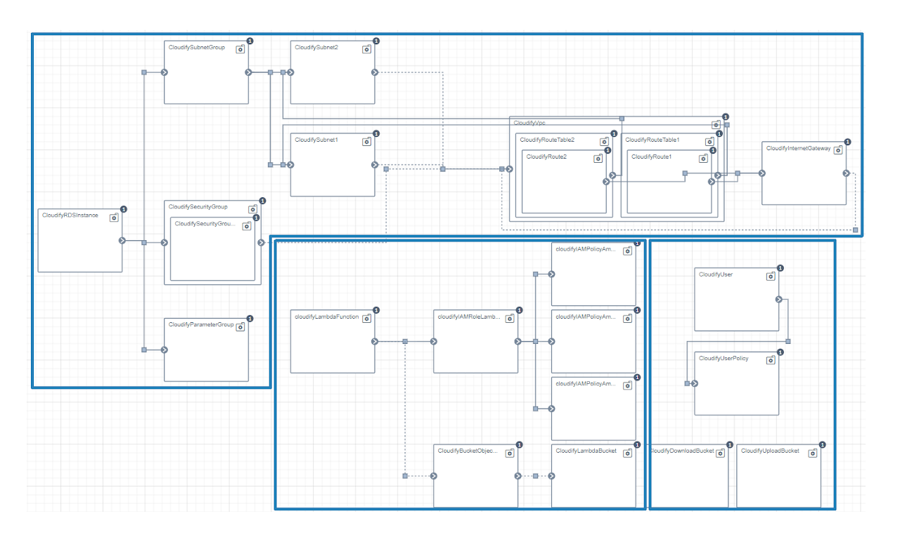

Below, you find links to complementary material and additional resources referenced by the paper.

### Cloudify Blueprint

We present the Cloudify blueprint we developed for an architecture that we later deployed for the eGovernment scenario. The source code of the Cloudify Blueprint is available [**here**](assets/TOPS2020_2/blueprint.yaml).

Each white rectangle is a node and it represents a cloud service (e.g., security groups, cloud functions). Links are relationships between nodes and are used to control the deployment flow. The blueprint contains three main clusters (blue borders). The cluster on top models the relational database service (i.e., MS, a Relational Database Service in AWS) while the cluster in the middle models the cloud function (i.e., RM, a Lambda function in AWS). The last cluster on the bottom-right corner models the storage service (i.e., DS, a S3 service in AWS). The proxy runs in the users' computers. Therefore, the proxy is not part of the blueprint.

### Fully Working Prototype

We developed a fully working prototype implementing the cryptographic access control scheme developed by [**Garrison et al.**](https://arxiv.org/pdf/1602.09069). You can find the source code in the [**GitHub repository**](https://github.com/stfbk/CryptoAC). The prototype was tested with several simulated sequences of operations combining the creation of users and roles, assignment and revoking of permissions and the creation, update and management of files. The prototype offers a user interface based on web technologies and RESTful APIs.

<video width="1280" height="720" controls>
    <source src="assets/TOPS2020_2/prototype.mp4" type="video/mp4">
    Your browser does not support the video tag.
</video>    
 

### Web Dashboard

We implemented the Multi-Objective Combinatorial Optimization Problem (MOCOP) in a web dashboard. The dashboard allows selecting the  algorithm and metric to use to evaluate architectures and configuring pre-filters. Then, the dashboard allows setting trust assumptions, weights and soft-hard constraints. The optimization problem is solved in real-time and the resulting architectures, along with the effect on the goals, are shown in the last blue section. You can freely [**interact with the dashboard here**](assets/TOPS2020_2/dashboard.html).