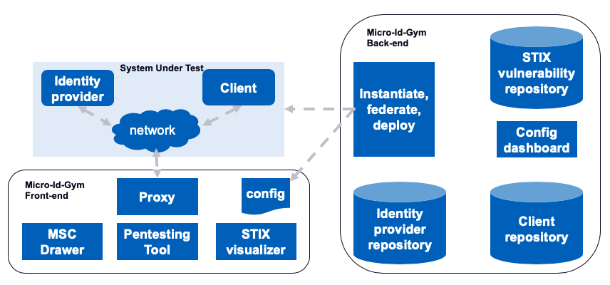

**Micro-Id-Gym** is a framework where users can develop hands-on experiences on how IdM solutions work and increase their awareness related to the underlying security issues. It is open-source, released under [Apache-2.0](https://www.apache.org/licenses/LICENSE-2.0) license and and you can contribute by visiting the project’s [repository](https://github.com/stfbk/micro-id-gym).

<!--The tool is available on request. If you are interested in trying the tool, please contact us via email. 
(Contact information is available at the bottom of this webpage.)-->


# Architecture
The Micro-Id-Gym Backend is used to recreate locally a sandbox as an instance of an IdP and a C and it can be done by uploading the own proprietary sandbox or by composing a new sandbox choosing the instances of IdPs and Cs provided by the IdP and C repositories.

The Micro-Id-Gym Frontend consists of tools to support user pentesting activities on the System Under Test (SUT), namely a Proxy, a set of Pentesting Tools, and two tools called MSC Drawer and MSC STIX Visualizer. As already mentioned, the SUT can be a sandbox or any IdM protocol available on Internet.

## Micro-Id-Gym Backend
The goal of the Micro-Id-Gym Backend is by construction to provide a test environment generator tailored to IdM protocols and deploy the environment in the SUT. Given a set of available IdM protocol implementations collected while using the tool for third parties, the SUT automatically sets-up a working environment in a local network. It contains:

- **Config Dashboard** It is used to choose the IdM protocols as an IdP instance and one or more C instance(s) to deploy in the SUT, among the ones available. It is also used to configure some components of the Micro-Id-Gym Frontend.
- **Client Repository** It contains the instances of Client.
- **Identity Provider Repository** It contains the instances of Identity Provider.
- **STIX vulnerability repository** It contains Cyber Threat Intelligence information useful for assessing vulnerabilities following the Structured Threat Information Expression (STIX) format proposed by OASIS CTI TC.

## Micro-Id-Gym Frontend
The Micro-Id-Gym Frontend contains tools used to support user pentesting activities in a sandbox (generated by the Micro-Id-Gym Backend) or in internet. It is composed by:

- **Proxy** It is a web proxy tool that intercepts the HTTP traffic between a browser and the servers of the SUT.
- **MSC Drawer** It provides a message sequence chart of the authentication flow and it allows easier inspection of the exchanged messages.
- **Pentesting Tool** It supports a user to perform pentesting of an IdM protocol deployment, by providing instruments to automatically detect security issues. The tools perform both passive and active tests.

# Additional Contributors
Bachelor's and master's students from the University of Trento,
involved in internships and theses in FBK.

- Lorenzo Tait: "A Customized Threat Modeling for Secure Deployment and
Pentesting of SAML SSO Solutions" (bachelor's thesis).

- Ivan Martini: "An Automated Security Testing Framework for SAML SSO
deployments" (bachelor's thesis).

- Valentina Odorizzi: "Progettazione e sviluppo di uno strumento per
l'analisi automatica di vulnerabilit&agrave; "Missing XML Validation" in SAML
SSO" (bachelor's thesis).

- Giulio Pellizzari: "Design and implementation of a tool to detect
Login Cross-Site Request Forgery in SAML SSO: G Suite Case Study" 
(bachelor's thesis).

- Leonidas Vasileiadis.
