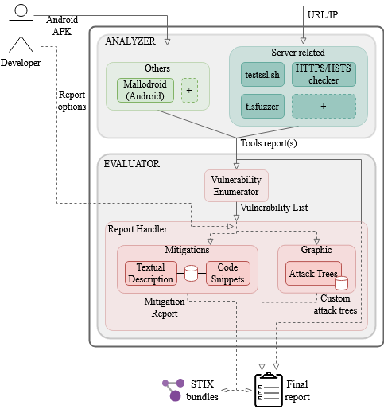

**TLSAssistant** is a fully-featured tool that combines state-of-the-art TLS analyzers with a report system that suggests appropriate mitigations and shows the full set of viable attacks. It is open-source, released under [Apache-2.0](https://www.apache.org/licenses/LICENSE-2.0) license and and you can contribute by visiting the project's [repository](https://github.com/stfbk/tlsassistant). 

The tool has been developed within [Digimat](https://ict.fbk.eu/partnerships/co-innovation-labs/ipzs/), a joint lab between [Poligrafico e Zecca dello Stato](https://www.ipzs.it/ext/index.html) and [FBK-ICT](https://ict.fbk.eu/).



# Architecture

TLSAssistant is written in Bash and can thus be invoked via  command-line. Among the available parameters, the tool takes as input  the target to be evaluated (e.g., the IP address of a server) and  outputs a single report file. The content of the report depends on the  detected weaknesses and on the level of verbosity the user chose. Being  built on top of other works, our TLSAssistant has been designed to be  modular and easily upgradable. The image above shows the current  architecture with its two main components: Analyzer and Evaluator. 

## Analyzer

It takes as input a series of options depending on which analysis the user wants to run. 
By design, our tool has a flexible architecture that allows a continuous integration of newer and more sophisticated tools. Currently, the set of integrated tools consists of command-line scripts written either in Bash or Python. 

TLSAssistant currently integrates four tools that provide state-of-the-art analysis:

- [mallodroid](https://github.com/sfahl/mallodroid)
- [testssl.sh](https://github.com/drwetter/testssl.sh)
- [tlsfuzzer](https://github.com/tomato42/tlsfuzzer)
- [TLS Extended_Master_Checker](https://github.com/Tripwire-VERT/TLS_Extended_Master_Checker)
- **HTTP/HSTS checker** is the first module built in house, it contains a set of simple commands that can detect lack of proper HSTS configuration and other minor checks.

## Evaluator

It is the core of TLSAssistant and constitutes our main contribution. It is responsible for the enumeration of the detected vulnerabilities and the generation of the report that will guide the system administrator towards all the mitigations to be applied. It can be seen as the combination of two submodules:

**Vulnerability enumerator** collects and analyzes the reports generated by the *Analyzer*. By parsing the inputs, this module is able to compile a list containing all the discovered vulnerabilities. The mapping between reports' content and enumeration is based on the attack trees' prerequisites collection.

**Report handler** takes the vulnerability list and, in accordance with the system administrator's choice, renders the final output. TLSAssistant is currently able to generate reports by combining the content of two modules: *Mitigations* and *Graphic*. The former consists of a shared database containing a list of all the known TLS vulnerabilities with their descriptions, CVE ID, CVSS score and related fixes while the latter contains a set of modeled attack trees written in the graph description language DOT. The Report Handler currently offers four kinds of report, each version provides the content of the previous one and adds more technical details. For every detected weakness, the main information contained in each version of the report is the following:

- **v0** mitigations’ description. It is the most basic form of report, it contains a description of the vulnerability (along with its *CVE* and *CVSS* values) and a brief explanation of the actions to perform;
- **v1** code snippet. It provides a fragment of code that can be copy-pasted into the webserver's configuration to seamlessly fix the weakness. TLSAssistant can detect any webserver but is currently only able to provide snippets for *Apache* and *nginx* HTTP server. We plan to extend the code coverage to all the most common webservers available on the market. Together with the snippet, the report will provide a set of steps on how to find the correct file/line to edit; 
- **v2** tools’ individual reports. In addition to our detailed contribution, this kind of report also provides the full set of individual reports generated by each tool;
- **v3** highlighted attack trees. It is the most complete version of the report that TLSAssistant offers to date. By automatically highlighting the exploitable components and compiling the DOT sources, the custom generated trees graphically show the attacks that can be mounted on the target system.

# Features

Thanks to the integrated analyzers, TLSAssistant is currently able to detect and provide mitigations for: 
  - [3SHAKE](https://mitls.org/pages/attacks/3SHAKE)
  - [Bar Mitzvah](https://www.imperva.com/docs/HII_Attacking_SSL_when_using_RC4.pdf)
  - [BREACH](http://breachattack.com)
  - [Client-Initiated Renegotiation DoS](https://cve.mitre.org/cgi-bin/cvename.cgi?name=CVE-2011-1473)
  - [CRIME](https://docs.google.com/presentation/d/11eBmGiHbYcHR9gL5nDyZChu_-lCa2GizeuOfaLU2HOU/edit#slide=id.g1d134dff_1_222)
  - [DROWN](https://drownattack.com)
  - [HSTS not preloaded](https://hstspreload.org)
  - [HSTS not set](https://tools.ietf.org/html/rfc6797)
  - [HTTPS not enforced](https://tools.ietf.org/html/rfc6797#section-7.2)
  - [Lucky13](http://www.isg.rhul.ac.uk/tls/Lucky13.html)
  - [Missing Certificate Transparency](http://www.certificate-transparency.org)
  - [POODLE](https://www.openssl.org/~bodo/ssl-poodle.pdf)
  - [RC4NOMORE](https://www.rc4nomore.com)
  - [ROBOT](https://robotattack.org)
  - [SLOTH](https://www.mitls.org/pages/attacks/SLOTH)
  - [Sweet32](https://sweet32.info)
  - [Unsecure Android TrustManagers](https://dl.acm.org/citation.cfm?id=2382205)